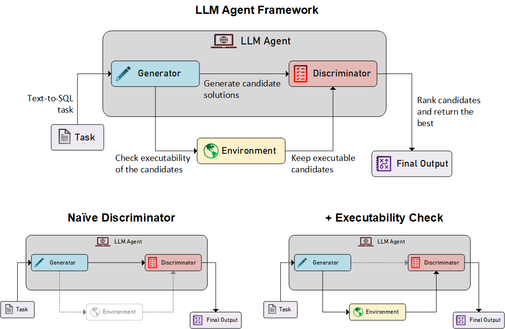
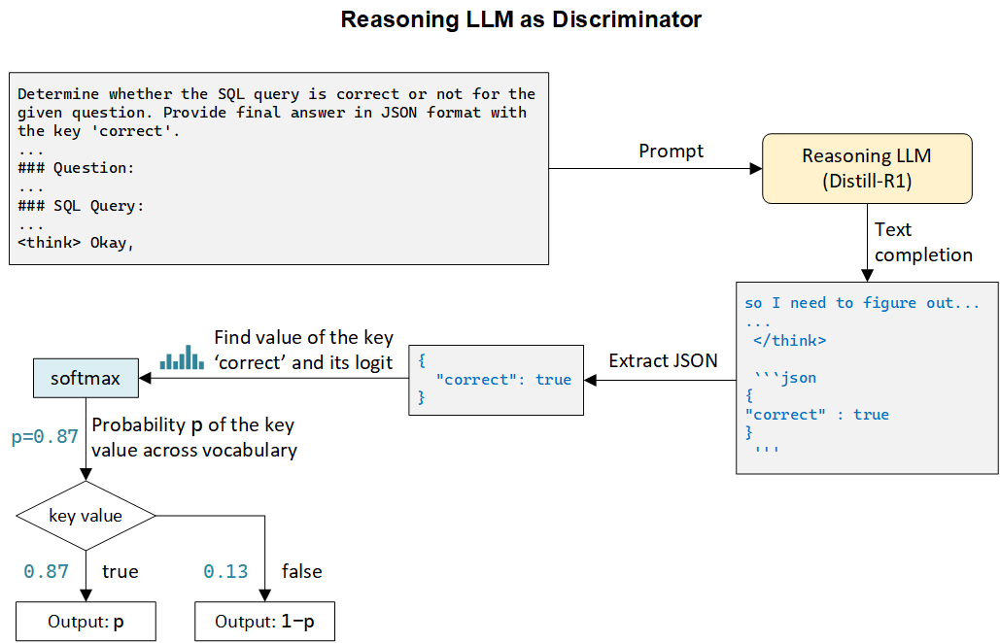

# When Reasoning Beats Scale: A 1.5B Reasoning Model Outranks 13B LLMs as Discriminator
Code and data for our paper [When Reasoning Beats Scale: A 1.5B Reasoning Model Outranks 13B LLMs as Discriminator](https://arxiv.org/abs/2505.03786).




## Abstract
Large Language Models (LLM) with reasoning capabilities offer a promising path for improving candidate evaluation in planning frameworks, but their relative performance against traditional non-reasoning models remains largely underexplored. In this study, we benchmark a distilled 1.5B parameter reasoning model (DeepSeek-R1) against several state-of-the-art non-reasoning LLMs within a generator-discriminator LLM planning framework for the text-to-SQL task. For this, we introduce a novel method for extracting soft scores from the chain-of-thought (CoT) outputs from reasoning that enables fine-grained ranking of candidates. Our central hypothesis is that reasoning models are more effective discriminators than non-reasoning LLMs. Our results show that distilled DeepSeek-R1-1.5B achieves up to 87% higher F1 and 3.7% better discrimination accuracy than CodeLlama-7B, as well as 3.7% higher execution accuracy than CodeLlama-13B, despite having significantly fewer parameters. Furthermore, we find that there is a limit to the logical capabilities of reasoning models, and only providing more context or allowing more compute budget for reasoning is not enough to improve their discrimination performance. Finally, we demonstrate that, unlike non-reasoning LLMs, reasoning models find generation more challenging than discrimination and may underperform as generators compared to smaller non-reasoning LLMs. Our work highlights the potential of reasoning models as discriminators in agentic frameworks, far outweighing their capabilities as generators, offering insights into their optimal role within LLM planning infrastructures. 


## Brief Summary


In this work, we examine the role of a reasoning model within a generator-discriminator LLM planning agentic framework applied to the text-to-SQL generation task. For this, we use a distilled 1.5B model of DeepSeek-R1 and hypothesize that reasoning models may serve as more effective discriminators and conduct a systematic investigation guided by the following research questions:

1. How does incorporating a reasoning LLM as the discriminator influence the accuracy and overall performance of the agentic framework?

2. What is the impact of inference-time CoT compute budget and contextual augmentation on the discrimination performance?

3. How does a reasoning model perform in the generator role, and is it better at generation than discrimination?

To this end, we analyze and comprehensively evaluate DeepSeek-R1’s discrimination as well as generation abilities within our LLM planning framework and compare the performance with several SOTA non-reasoning LLMs. An additional challenge arises in the extraction of soft scores from CoT reasoning outputs. Traditional non-reasoning LLMs can easily provide logit-based scores for discrimination, but in reasoning models, the arbitrarily long and unstructured nature of the CoT trace complicates soft score extraction. To address this, we propose a novel approach for deriving soft scores from the reasoning outputs, enabling more refined discrimination.

Our work evaluates LLMs’ ability to discriminate correct and incorrect SQL queries by re-labeling oracle-generated outputs, measuring both classification and ranking. Discriminator performance is tested in a naive setting and an enhanced setting that filters by executability via environment-based validation. We further test whether LLMs can select correct queries from dynamically generated candidates. We analyze DeepSeek-R1’s reasoning quality through lexical, structural, and semantic diversity and examine three key factors influencing its discrimination performance: (1) increased test-time compute budget, (2) prompt augmentation with database schema context, and (3) the use of binary decisions vs. logit-based soft scores. Finally, we evaluate LLMs’ performance as generators in the full LLM planning pipeline. Our contributions in this work are as follows:

1. We provide a systematic comparison of reasoning and non-reasoning LLMs within a generator-discriminator LLM planning framework for the text-to-SQL task.

2. We introduce a novel use of reasoning models as discriminators by deriving soft scores from their outputs for more fine-grained candidate ranking.

3. We show that DeepSeek-R1 excels at discrimination, outperforming larger non-reasoning models. In particular, we find that a 1.5B distilled DeepSeek-R1 model achieves 87% higher F1 as well as 3.7% better discrimination accuracy than CodeLlama-7B and 3.7% higher execution accuracy than CodeLlama-13B. Furthermore, logit-based soft scoring vs. binary true/false discrimination yields minimal differences (<1.5%).

4. We find that reasoning models have limited logical capacity and adding more context or compute budget yields diminishing returns (e.g., <0.4% gain beyond 1024 tokens), while extremely low budgets severely degrade performance (<2% accuracy, >94% failure).

5. Finally, we show that while DeepSeek-R1 is a strong discriminator, it underperforms as a generator, even compared to smaller non-reasoning LLMs. We find that, similar to humans, generation is more challenging than discrimination for reasoning models [9] , in contrast to non-reasoning LLMs [5, 36, 10, 31].

In summary, our work investigates the role of DeepSeek-R1 within an LLM planning framework for text-to-SQL task. Through this study, we seek to advance our understanding of reasoning-based LLMs and inform future efforts in designing robust, efficient, and scalable autonomous systems.

## Citation

If you use this code and/or data in your project, please cite our work. We appreciate your acknowledgment!

> **When Reasoning Beats Scale: A 1.5B Reasoning Model Outranks 13B LLMs as Discriminator**,
> *Md Fahim Anjum*  
> [arXiv version](https://arxiv.org/abs/2505.03786)  

Bibtex citation:
```bibtex
@misc{anjum2025reasoningbeatsscale15b,
      title={When Reasoning Beats Scale: A 1.5B Reasoning Model Outranks 13B LLMs as Discriminator}, 
      author={Md Fahim Anjum},
      year={2025},
      eprint={2505.03786},
      archivePrefix={arXiv},
      primaryClass={cs.LG},
      url={https://arxiv.org/abs/2505.03786}, 
}
```


## Table of Contents

1. [Installation and Setup](#1-installation-and-setup)
2. [Data and Preprocessing](#2-data-and-preprocessing)
3. [File Structure](#3-file-structure)
4. [Experiments](#4-experiments)
5. [Additional Citations](#5-additional-citations)
6. [Attribution](#6-attribution)


## Installation and Setup

Run the following commands to create a conda environment:
```sh
conda env create -f environment.yml
conda activate r1
```


## Data and Preprocessing

- To preprocess text-to-SQL dataset, 
  1. Download the original Spider dataset from this [link](https://drive.google.com/uc?export=download&id=1TqleXec_OykOYFREKKtschzY29dUcVAQ).
  2. Run the `preprocess.ipynb` 
- Or, download preprocessed data at this [link](https://buckeyemailosu-my.sharepoint.com/:u:/g/personal/chen_8336_buckeyemail_osu_edu/ETFggRmzpqpOlbP1Sk7_qYcBtXe-VQaam-ERsOeDwQCryA?e=2UfJuM) and unzip it inside `data` folder.


## File Structure
```
llm-planning-reasoning/
├── assets/               # Directory for images and other assets
│   └── ...      
├── data/                 # Preprocessed data 
│   ├── spider/
│   │   └── ...           # Spider dataset (downloaded and unzipped here)
│   └── ...               # Preprocessed data (downloaded and unzipped here)
├── configs/              # Configuration files 
│   └── ...               
├── log/                  # Directory for storing run logs 
│   └── ...               
├── results/              # Directory for storing experiment outputs
│   │   └── ...
├── modules/              # LLM planning framework modules              
│   │   └── ...
├── preprocess/           # Preprocessing modules
│   └── ...               
├── test-suite-sql-eval/  # Cloned repository for Spider SQL evaluation
│   └── ...
├── utils/                # Utility functions and classes
│   └── ...
├── environment.yml       # Conda environment definition file
├── README.md             # The main README file
└── ...                   # Main .py and notebook files

```

## Experiments

### 1. Intrinsic Evaluation
- Run `eval_intrinsic.ipynb` for step by step execution
- For batch-run, run `eval_intrinsic_batch.py`

### 2. End-to-End Evaluation
- Run `eval_end2end.ipynb` for step by step execution
- For batch-run, run `eval_end2end_batch.py`
- If you have low VRAM, you can run the end-to-end in parts by running `eval_end2end_in_parts.py`

### 3. Result 
- After running the above experiments, run `result_calc.ipynb`


## Additional Citations
Cite the following paper for the original contribution of the LLM planning framework:
```
@misc{chen2024tree,
      title={When is Tree Search Useful for LLM Planning? It Depends on the Discriminator}, 
      author={Ziru Chen and Michael White and Raymond Mooney and Ali Payani and Yu Su and Huan Sun},
      year={2024},
      eprint={2402.10890},
      archivePrefix={arXiv},
      primaryClass={cs.CL}
}
```

Cite the original datasets and evaluation methods:
```
@inproceedings{yu-etal-2018-spider,
    title = "{S}pider: A Large-Scale Human-Labeled Dataset for Complex and Cross-Domain Semantic Parsing and Text-to-{SQL} Task",
    author = "Yu, Tao  and
      Zhang, Rui  and
      Yang, Kai  and
      Yasunaga, Michihiro  and
      Wang, Dongxu  and
      Li, Zifan  and
      Ma, James  and
      Li, Irene  and
      Yao, Qingning  and
      Roman, Shanelle  and
      Zhang, Zilin  and
      Radev, Dragomir",
    editor = "Riloff, Ellen  and
      Chiang, David  and
      Hockenmaier, Julia  and
      Tsujii, Jun{'}ichi",
    booktitle = "Proceedings of the 2018 Conference on Empirical Methods in Natural Language Processing",
    month = oct # "-" # nov,
    year = "2018",
    address = "Brussels, Belgium",
    publisher = "Association for Computational Linguistics",
    url = "https://aclanthology.org/D18-1425",
    doi = "10.18653/v1/D18-1425",
    pages = "3911--3921",
}
```

```
@inproceedings{zhong-etal-2020-semantic,
    title = "Semantic Evaluation for Text-to-{SQL} with Distilled Test Suites",
    author = "Zhong, Ruiqi  and
      Yu, Tao  and
      Klein, Dan",
    editor = "Webber, Bonnie  and
      Cohn, Trevor  and
      He, Yulan  and
      Liu, Yang",
    booktitle = "Proceedings of the 2020 Conference on Empirical Methods in Natural Language Processing (EMNLP)",
    month = nov,
    year = "2020",
    address = "Online",
    publisher = "Association for Computational Linguistics",
    url = "https://aclanthology.org/2020.emnlp-main.29",
    doi = "10.18653/v1/2020.emnlp-main.29",
    pages = "396--411",
}
```


## Attribution
Key contributions and dependencies:

- **LLM Planning Framework** adapted from [When is Tree Search Useful for LLM Planning? It Depends on the Discriminator](https://github.com/OSU-NLP-Group/llm-planning-eval), restructured and optimized for better modularity and reasoning model integration.
- **Dataset** sourced from the [SPIDER repository](https://aclanthology.org/D18-1425), with custom preprocessing and flexible data loading integrated into the pipeline.
- **Pretrained models** imported from the [HuggingFace Hub](https://huggingface.co/).
- **Evaluation framework** extended from [Semantic Evaluation for Text-to-SQL with Test Suites](https://github.com/taoyds/test-suite-sql-eval), with addditional metrics.

